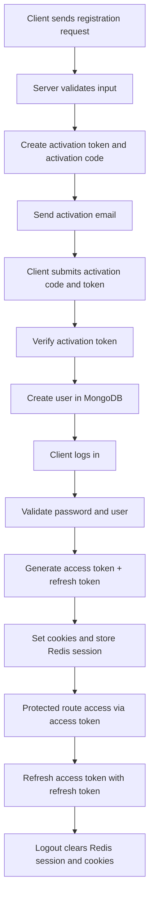
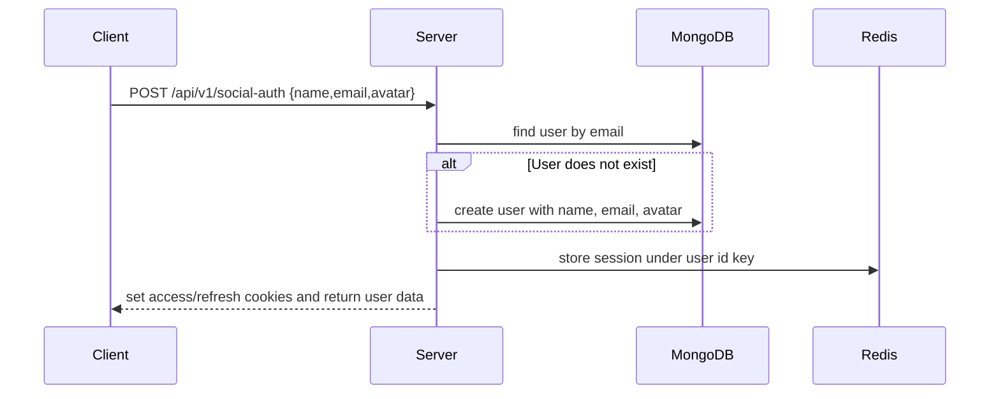

# Authentication & User Management System

## 1. Overview

This backend implements a cookie-based authentication layer for a learning management system using JSON Web Tokens (JWTs), a MongoDB user model, and a Redis-backed session store. The system is built around the user account lifecycle of registration, activation, login, token refresh, logout, profile updates, password changes, and avatar upload.

### Purpose

The authentication system exists to:

- identify users securely across API requests,
- protect authenticated routes,
- issue short-lived access tokens and long-lived refresh tokens,
- persist lightweight session state in Redis,
- support profile management operations such as name/email update, password update, and avatar upload.

### Authentication strategy

The implementation uses a hybrid approach:

- JWTs for stateless identity and authorization,
- HTTP-only cookies for transporting tokens to the client,
- Redis for session presence checks and session invalidation,
- Mongoose for persistent user storage,
- rate limiting to reduce brute-force abuse.

This is a server-side authentication strategy rather than a full OAuth provider implementation. The codebase contains a social-auth endpoint, but it does not implement a full Google OAuth callback flow or Google SDK integration.

---

## 2. Folder Structure

### Authentication-related folders and files

- [server/controllers/user.controller.ts](../controllers/user.controller.ts)  
  Request handlers for registration, activation, login, logout, token refresh, profile updates, password update, and avatar updates.

- [server/services/auth.service.ts](../services/auth.service.ts)  
  Core business logic for registration, account activation, login, logout, access-token refresh, social authentication, profile updates, password update, and avatar upload.

- [server/routes/user.route.ts](../routes/user.route.ts)  
  Defines all authentication and user-management routes.

- [server/models/user.model.ts](../models/user.model.ts)  
  User schema, password hashing behavior, and JWT helper methods.

- [server/middlewares/auth.ts](../middlewares/auth.ts)  
  Protects routes by verifying the access token from cookies and checking Redis session state.

- [server/middlewares/catchAsyncErrors.ts](../middlewares/catchAsyncErrors.ts)  
  Wraps async handlers so thrown errors are passed to Express error middleware.

- [server/middlewares/ErrorMiddleware.ts](../middlewares/ErrorMiddleware.ts)  
  Converts application errors into JSON error responses.

- [server/middlewares/rateLimiter.ts](../middlewares/rateLimiter.ts)  
  Adds global, login, registration, and password-reset rate limits.

- [server/config/multer.ts](../config/multer.ts)  
  Configures in-memory file upload handling for avatar files.

- [server/config/cloudinary.ts](../config/cloudinary.ts)  
  Configures the Cloudinary SDK for image upload.

- [server/utils/jwt.ts](../utils/jwt.ts)  
  Generates tokens, sets HTTP-only cookies, and stores session data in Redis.

- [server/utils/redis.ts](../utils/redis.ts)  
  Creates and configures the Redis client.

- [server/utils/activationToken.ts](../utils/activationToken.ts)  
  Generates activation tokens and activation codes for account activation.

- [server/utils/sendMail.ts](../utils/sendMail.ts)  
  Sends email notifications used during registration.

- [server/mails/activation-mail.ejs](../mails/activation-mail.ejs)  
  Email template used for the registration activation step.

- [server/interfaces/auth.interface.ts](../interfaces/auth.interface.ts)  
  Type definitions for registration, activation, login, and social-auth payloads.

- [server/interfaces/jwt.interface.ts](../interfaces/jwt.interface.ts)  
  Defines JWT-related TypeScript interfaces.

- [server/docs/authentication-system.md](authentication-system.md)  
  This document.

---

## 3. User Model

The user schema is defined in [server/models/user.model.ts](../models/user.model.ts).

### Fields

#### name

- Type: String
- Required: yes
- Validation: trimmed
- Purpose: stores the user's display name used in the account and returned in API responses.

#### email

- Type: String
- Required: yes
- Validation: email regex via a custom validator
- Behavior: unique, lowercase, trimmed
- Purpose: the primary login identifier and a uniqueness constraint for the account.

#### password

- Type: String
- Required: no
- Validation: minimum length 8 characters
- Behavior: hidden from normal queries via `select: false`
- Purpose: used for local authentication. It is optional because the codebase also supports social-auth sign-in, where a user may not have a local password.

#### avatar

- Type: nested object with `public_id` and `url`
- Purpose: stores Cloudinary metadata and the public image URL for the user profile picture.
- Default values: empty strings for both fields.

#### role

- Type: String
- Allowed values: `user` and `admin`
- Default: `user`
- Purpose: identifies the user's role. The current implementation exposes the role on the login response and user payload, but there is no dedicated role-based authorization middleware in the repository.

#### isVerified

- Type: Boolean
- Default: `false`
- Purpose: represents whether the account has been verified. It is currently present in the schema but does not appear to be enforced in the registration/login flow at this time.

#### courses

- Type: Array of objects containing `courseId`
- Purpose: stores references to courses associated with the user.
- Current usage: schema-level persistence for course enrollment references; it is not used in the authentication lifecycle.

#### Timestamps

- Mongoose timestamps are enabled.
- Fields generated automatically: `createdAt` and `updatedAt`.
- Purpose: useful for auditing and lifecycle tracking.

### Additional behavior implemented in the model

The schema defines methods that are used by the auth system:

- `comparePassword(password)`: compares a supplied password with the stored hash using `bcryptjs`.
- `signAccessToken()`: creates an access token with expiration `15m`.
- `signRefreshToken()`: creates a refresh token with expiration `7d`.

### Why these fields exist

The schema is deliberately minimal and focused on identity, account state, profile information, and basic authorization context. The design supports:

- local registration/login,
- social-auth identity creation,
- profile image management,
- future role-based access control,
- course ownership or enrollment references.

---

## 4. Authentication Flow

The authentication lifecycle begins with registration and ends with token invalidation on logout.

### High-level lifecycle



### Registration and activation path

1. The user submits registration data.
2. The server validates the input and checks whether the email is already in use.
3. The server creates an activation code and an activation JWT.
4. The activation email is sent to the user.
5. The user activates the account by posting the activation code and activation token.
6. The actual user record is created in MongoDB.

### Login and token issuance path

1. The user logs in with email and password.
2. The server loads the user document, including the password hash.
3. The password is verified with `bcryptjs`.
4. The server creates access and refresh tokens.
5. The session is stored in Redis using the user's MongoDB ID as the key.
6. The server sets HTTP-only cookies on the response.

### Refresh and logout path

1. The client requests a new access token using the refresh token cookie.
2. The server verifies the refresh token signature and checks Redis for the session.
3. If the session exists, a new access token is issued.
4. On logout, the Redis session key is deleted and the cookies are cleared.

---

## 5. Registration Flow

The registration flow is implemented in [server/controllers/user.controller.ts](../controllers/user.controller.ts) and [server/services/auth.service.ts](../services/auth.service.ts).

### Step-by-step flow

#### Request

The route is:

- `POST /api/v1/registration`

Expected body:

- `name`
- `email`
- `password`

#### Validation

The service checks that all three fields are present. If any are missing, the server throws a `400` error.

It also checks whether the email already exists in MongoDB. If it does, the server throws a `409` error.

#### Password hashing

The password is not hashed during the registration request itself. Hashing is performed by the Mongoose pre-save hook in [server/models/user.model.ts](../models/user.model.ts) when the user record is eventually created during account activation.

#### User creation

The actual user creation does not happen immediately in the registration request handler. Instead, the registration service creates an activation payload, a random activation code, and an activation JWT. The actual user record is created later by the activation endpoint:

- `POST /api/v1/activate-user`

The activation service verifies the activation JWT and compares the activation code. If valid, it creates the user in MongoDB.

#### Token generation

The activation token is created via [server/utils/activationToken.ts](../utils/activationToken.ts):

- an activation code is generated as a six-digit string,
- the activation JWT is signed with `ACTIVATION_SECRET_KEY`,
- the token expires after `10m`.

#### Response

The registration response returns:

- `success: true`
- a message instructing the user to check email for activation,
- the generated `activationToken` object.

---

## 6. Login Flow

The login flow uses the route:

- `POST /api/v1/login`

### Step-by-step flow

#### Email lookup

The service searches for a user by email using `User.findOne({ email }).select("+password")`.

If no matching user is found, the server returns a `401` error with the message `Invalid email or password`.

#### Password verification

The password is verified using the `comparePassword` method from the user model. This method uses `bcryptjs.compare()` against the stored hash.

If the password does not match, the server returns `401`.

#### JWT generation

Once the user is authenticated, the `sendToken()` utility issues:

- an access token using `user.signAccessToken()`,
- a refresh token using `user.signRefreshToken()`.

The access token expires after `15m`, while the refresh token expires after `7d`.

#### Refresh token

The refresh token is signed with `JWT_REFRESH_SECRET` and set as an HTTP-only cookie named `refreshToken`.

#### Cookies

Both tokens are attached as cookies:

- `accessToken`
- `refreshToken`

Both cookies are marked `httpOnly`, and `secure` is enabled when `NODE_ENV` is `development` or `production`.

#### Redis updates

The login flow stores the user object in Redis under the key equal to the MongoDB user ID. The value is the JSON-stringified user object with a TTL of `7d`.

This makes the login session discoverable by the authentication middleware and the access-token refresh logic.

---

## 7. Google OAuth Login

The repository does not implement a true Google OAuth provider integration as of the current codebase.

### What is implemented

The server exposes a social-auth endpoint:

- `POST /api/v1/social-auth`

This endpoint accepts a payload resembling a third-party identity provider response:

- `name`
- `email`
- `avatar`

### Current social-auth flow



### Important limitation

The current codebase does not include:

- a Google OAuth redirect endpoint,
- Google callback handling,
- token exchange with Google's identity service,
- PKCE/state handling,
- provider-specific secret management.

In other words, the server supports a generic social-auth entry point, but it does not currently implement a complete Google OAuth login flow from the provider side.

---

## 8. JWT Authentication

JWTs are generated in [server/models/user.model.ts](../models/user.model.ts) and issued via [server/utils/jwt.ts](../utils/jwt.ts).

### Access Token

- Generated by `signAccessToken()`
- Secret: `JWT_ACCESS_SECRET`
- Expiration: `15m`
- Purpose: short-lived bearer token used to authorize protected requests.

### Refresh Token

- Generated by `signRefreshToken()`
- Secret: `JWT_REFRESH_SECRET`
- Expiration: `7d`
- Purpose: used to obtain a fresh access token without requiring the user to log in again.

### Why two tokens are used

The implementation uses two tokens to separate short-lived authorization from long-lived session renewal:

- the access token is meant to be used frequently and expires quickly,
- the refresh token is used less often and remains valid longer,
- if an access token is compromised, its window is limited,
- the refresh token can be rotated or invalidated by removing the Redis session entry.

### Security benefits

- Reduced exposure window for access tokens.
- Easier revocation through Redis session invalidation.
- Keeps the user session manageable without requiring a database record for every token.

---

## 9. Redis Integration

Redis is initialized in [server/utils/redis.ts](../utils/redis.ts).

### Why Redis is used

Redis is used as a lightweight, fast session store for authentication state. The application uses it to confirm that a user has an active session before granting access to protected routes.

### What is stored

On successful login and social-auth authentication, the server stores:

- a Redis key equal to the user's MongoDB ID,
- a value containing the JSON-stringified user object,
- an expiration time of `7d`.

### Session lifecycle

1. Login creates a new Redis key.
2. Protected-route middleware checks for the key.
3. Access-token refresh checks for the key.
4. Logout deletes the key.
5. If the key is absent, the user is treated as logged out or session-expired.

### Cache updates

The Redis session entry is refreshed when the user updates profile information, changes the password, or uploads a new avatar. The service writes the current user document back to Redis with the same key and TTL.

### Cache invalidation

Redis is invalidated in two ways:

- logout deletes the key,
- the access-token refresh logic rejects requests when the key is absent.

---

## 10. Authentication Middleware

Protected routes are guarded by [server/middlewares/auth.ts](../middlewares/auth.ts).

### How it works

1. It reads the `accessToken` from the request cookies.
2. If no token is present, it returns a `401` error: `Please login to access this resource`.
3. It attempts to verify the token using `JWT_ACCESS_SECRET`.
4. If verification fails, it returns a `401` error: `Invalid or expired access token`.
5. It checks Redis for a session entry using the decoded user ID.
6. If the session is missing, it returns `401` with `Session expired. Please login again.`.
7. It loads the user from MongoDB.
8. If the user exists, it attaches the document to `req.user` and calls `next()`.

### Request augmentation

The middleware mutates the Express request by attaching:

- `req.user = user`

This makes the authenticated user available to downstream controllers.

### Error handling

The middleware uses the same `ErrorHandler` mechanism as the rest of the application. Any failed authentication attempt results in a structured JSON error response.

---

## 11. User Profile APIs

All routes are mounted under `/api/v1` in [server/app.ts](../app.ts).

| Method | Route | Purpose | Auth Required | Request Body | Response |
| --- | --- | --- | --- | --- | --- |
| POST | `/api/v1/registration` | Starts the registration flow by creating an activation token and sending an email | No | `name`, `email`, `password` | Returns success message and activation token payload |
| POST | `/api/v1/activate-user` | Verifies the activation token and creates the user account in MongoDB | No | `activationCode`, `activationToken` | Returns success message with created account fields |
| POST | `/api/v1/login` | Authenticates the user and issues access/refresh tokens | No | `email`, `password` | Sets cookies and returns access token + user payload |
| POST | `/api/v1/logout` | Invalidates the Redis session and clears cookies | Yes | None | Returns success message |
| GET | `/api/v1/access-token` | Issues a fresh access token from the refresh token cookie | No (but refresh token cookie is required) | None | Returns a new access token |
| GET | `/api/v1/me` | Returns the authenticated user's current profile | Yes | None | Returns the authenticated user document |
| POST | `/api/v1/social-auth` | Creates or authenticates a user using a social-auth payload | No | `name`, `email`, `avatar` | Sets cookies and returns access token + user payload |
| PATCH | `/api/v1/update-user-info` | Updates the user's `name` and/or `email` | Yes | `name` and/or `email` | Returns updated user data |
| PATCH | `/api/v1/update-password` | Updates the user's password after verifying the old password | Yes | `oldPassword`, `newPassword` | Returns success message and updated user |
| PATCH | `/api/v1/update-avatar` | Uploads and updates the user's avatar image | Yes | Multipart form-data containing `avatar` | Returns success message and updated user |

### Endpoint details

#### Registration

- Controller: `registerUserController`
- Service: `registerUserService`
- Behavior: validates input, checks for existing email, sends activation email, returns activation metadata.

#### Activate user

- Controller: `activateUserController`
- Service: `activateUserService`
- Behavior: verifies activation token/code and creates the user only if valid.

#### Login

- Controller: `loginUserController`
- Service: `loginUserService`
- Behavior: looks up the user, verifies password, issues tokens, sets cookies, stores Redis session.

#### Logout

- Controller: `logoutUserController`
- Service: `logoutUserService`
- Behavior: deletes the Redis session entry and clears the cookies.

#### Refresh access token

- Controller: `updateAccessTokenController`
- Service: `updateAccessTokenService`
- Behavior: requires the `refreshToken` cookie, verifies it, checks Redis, issues a new access token.

#### Current user profile

- Controller: `getUserByIdController`
- Service: `getUserByIdService`
- Behavior: returns the authenticated user document by reading `req.user`.

#### Social auth

- Controller: `socialAuthController`
- Service: `socialAuthService`
- Behavior: finds or creates the user, then issues tokens using the same cookie path as login.

#### Update user info

- Controller: `UpdateNameOrEmailController`
- Service: `updateEmailOrName`
- Behavior: updates the user's name and/or email. It rejects duplicate email addresses.

#### Update password

- Controller: `UpdatePasswordController`
- Service: `updateUserPassword`
- Behavior: requires the existing password, rejects Google-style social-auth accounts without a password, updates the password hash via the Mongoose pre-save hook, and refreshes Redis.

#### Update avatar

- Controller: `updateAvatarController`
- Service: `updateAvatarService`
- Behavior: receives an uploaded file, deletes the previous Cloudinary asset if it exists, uploads a new image, stores metadata on the user, saves the user, and refreshes Redis.

---

## 12. Password Update

The password update route is:

- `PATCH /api/v1/update-password`

### Process

1. The authenticated request reaches the controller with `req.user` populated by the auth middleware.
2. The controller reads `oldPassword` and `newPassword` from the request body.
3. If the current user has no password field, the service rejects the change with a `400` error because the account appears to be a social-auth account.
4. The service loads the user by ID and selects the password field using `select("+password")`.
5. It compares `oldPassword` to the stored hash using `comparePassword`.
6. If the old password is incorrect, it returns `401`.
7. The user password is replaced with the new plain text value.
8. The user document is saved so the Mongoose pre-save hook hashes the password.
9. The updated user document is written to Redis under the same session key.

### Validation behavior

The service validates:

- both old and new password fields must be present,
- old password must match the stored hash,
- the account must have a local password field.

---

## 13. Profile Update

The profile update route is:

- `PATCH /api/v1/update-user-info`

### Process

1. The authenticated request passes through `isAuthenticated`.
2. The controller receives `name` and/or `email` from the request body.
3. The service loads the user by ID.
4. If a new email is provided, the service checks whether the email already exists in MongoDB. If it does, the request is rejected with `409`.
5. If the user exists, the service updates the `name` and/or `email` fields.
6. The user document is saved.
7. The updated user is written to Redis to refresh the cached session state.

### Notes

- The implementation allows updating `name`, `email`, or both.
- The route does not send a verification email for the new email address; it simply updates the field.

---

## 14. Avatar Upload

The avatar upload route is:

- `PATCH /api/v1/update-avatar`

### Upload configuration

The upload middleware is defined in [server/config/multer.ts](../config/multer.ts).

- Storage: `multer.memoryStorage()`
- Field name: `avatar`
- File size limit: `2 MB`
- Allowed MIME types: `image/jpeg`, `image/png`, `image/webp`

The route uses `upload.single("avatar")`, meaning the request must be sent as `multipart/form-data` with a field named `avatar`.

### Complete avatar upload flow

```mermaid
flowchart TD
    A[Client sends PATCH /api/v1/update-avatar] --> B[Express middleware parses multipart/form-data]
    B --> C[upload.single("avatar") loads req.file]
    C --> D[Controller checks req.user and req.file]
    D --> E[Service loads current user from MongoDB]
    E --> F[Delete previous avatar from Cloudinary if public_id exists]
    F --> G[Upload file stream to Cloudinary upload_stream]
    G --> H[Receive public_id and secure_url]
    H --> I[Update user.avatar object in MongoDB]
    I --> J[Save user document]
    J --> K[Refresh Redis session entry]
    K --> L[Return updated user payload]
```

### Implementation details

1. The route injects the uploaded file into `req.file`.
2. The controller validates that `req.user` exists and that `req.file` exists.
3. The service loads the current user.
4. If the user already has a Cloudinary `public_id`, the previous avatar is deleted using `cloudinary.v2.uploader.destroy()`.
5. A new upload is sent using Cloudinary's `upload_stream()`.
6. The upload uses the folder `avatars` and resizes the image to `200x200` with crop mode `fill`.
7. The response includes `public_id` and `secure_url` from Cloudinary.
8. The user document is updated with:
   - `avatar.public_id`
   - `avatar.url`
9. The updated user is saved to MongoDB and refreshed into Redis.

### Why this design was chosen

- `multer.memoryStorage()` avoids writing the file to disk and is practical for a small, API-style image upload workflow.
- Cloudinary handles image storage, transformation, and delivery.
- Storing the Cloudinary public ID allows the application to delete old images later.

---

## 15. Error Handling

The backend uses a structured error-handling pattern across the auth modules.

### ErrorHandler class

Defined in [server/utils/ErrorHandler.ts](../utils/ErrorHandler.ts), `ErrorHandler` extends the built-in `Error` object and adds:

- `statusCode`
- `status`
- `isOperational`

It is used to raise intentional application errors, such as invalid input, duplicate email, or unauthorized access.

### CatchAsyncError

Defined in [server/middlewares/catchAsyncErrors.ts](../middlewares/catchAsyncErrors.ts), this wrapper catches rejected promises from async controllers and forwards them to Express error middleware.

### Global error middleware

Defined in [server/middlewares/ErrorMiddleware.ts](../middlewares/ErrorMiddleware.ts), this middleware standardizes error payloads:

- development mode returns detailed error information including `stack`,
- production mode hides stack traces and returns a generic `Internal Server Error` for unexpected failures,
- status codes and status strings are returned in the JSON error object.

---

## 16. Security Features

The current implementation includes a reasonable set of server-side security controls for this codebase.

### Password hashing

- Passwords are hashed with `bcryptjs` during the Mongoose pre-save hook.
- The user model uses password hashing before user persistence.
- The password field is hidden from normal queries with `select: false`.

### JWT-based authentication

- Access tokens are short-lived and used for API authorization.
- Refresh tokens are long-lived and used for renewing access tokens.
- JWTs are signed with separate secrets for access and refresh tokens.

### HTTP-only cookies

- Both access and refresh tokens are set in `httpOnly` cookies.
- This helps reduce exposure to client-side JavaScript access.
- Cookies are also marked `secure` in development and production environments.

### Authentication middleware

- Protected routes rely on [server/middlewares/auth.ts](../middlewares/auth.ts).
- The middleware validates the JWT and checks Redis session presence before proceeding.

### File validation

- Avatar uploads are constrained in [server/config/multer.ts](../config/multer.ts).
- Only `image/jpeg`, `image/png`, and `image/webp` files are accepted.

### File size limits

- Avatar uploads are capped at `2 MB`.

### Cloudinary integration

- Cloudinary stores profile pictures outside the database.
- The server keeps a `public_id` and `secure_url` for later deletion and retrieval.

### Protected routes

Routes that modify user state or return the current user profile are protected by the authentication middleware.

---

## 17. API Summary Table

| Method | Endpoint | Authentication Required | Description |
| --- | --- | --- | --- |
| POST | `/api/v1/registration` | No | Starts registration and sends activation email |
| POST | `/api/v1/activate-user` | No | Verifies activation token and creates the user |
| POST | `/api/v1/login` | No | Authenticates the user and issues session cookies |
| POST | `/api/v1/logout` | Yes | Deletes Redis session and clears cookies |
| GET | `/api/v1/access-token` | No (refresh cookie required) | Issues a fresh access token |
| GET | `/api/v1/me` | Yes | Returns the current authenticated user |
| POST | `/api/v1/social-auth` | No | Creates or signs in a user from a social-auth payload |
| PATCH | `/api/v1/update-user-info` | Yes | Updates name and/or email |
| PATCH | `/api/v1/update-password` | Yes | Updates the local password |
| PATCH | `/api/v1/update-avatar` | Yes | Uploads and stores a new avatar |

---

## 18. Future Improvements

The following improvements are not implemented in the current codebase, but they are natural next steps for a production-grade authentication system:

- Email verification enforcement beyond the registration activation token flow.
- Forgot password and password reset endpoints.
- Password reset tokens with expiry and email delivery.
- Multi-factor authentication (MFA).
- More sophisticated session management, including device/session revocation lists.
- Account locking after repeated failed login attempts.
- Auditing of authentication-sensitive operations.
- Role-based authorization middleware for `admin` and `user` access control.
- Refresh-token rotation and reuse detection.

---

## 19. Conclusion

The current authentication and user management system in this repository is a pragmatic backend implementation built around Express, Mongoose, JWT, Redis, Cloudinary, and Multer. It provides:

- registration and activation-based account creation,
- login and logout flows,
- access/refresh token issuance,
- session presence checks in Redis,
- authenticated profile APIs,
- password updates,
- avatar uploads,
- structured error handling and rate limiting.

The architecture is simple, practical, and well-suited to a service-oriented backend, but it still leaves room for stronger production hardening such as full email-verification workflows, password reset handling, MFA, and more granular role-based authorization.
